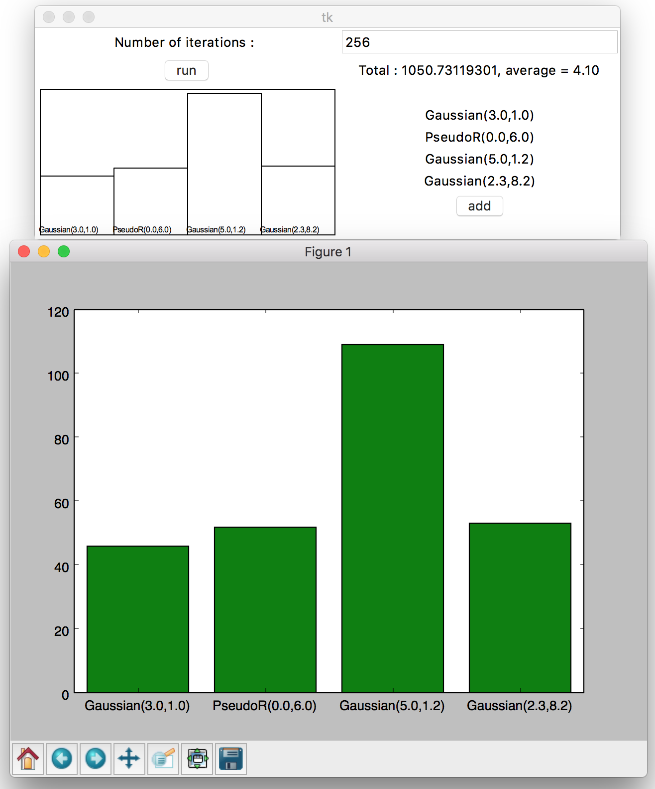

# Multi-Armed Bandit selection

# Description
This package is a possible implementation of the UCB1 selector. This selector can be used for Algorithm selection. 

Here it is used with random variables having different distributions.

## Example
Here is an example of run with four random variables.

 
## Paper
The algorithm developed here is from:

    Auer, P., Cesa-Bianchi, N., & Fischer, P. (2002). Finite-time analysis of the multiarmed bandit problem. Machine learning, 47(2-3), 235-256.

# Prerequisites
This package needs Tkinter. Optional : Matplotlib 

# Uses
Launch the package:

    python -m Bandit

